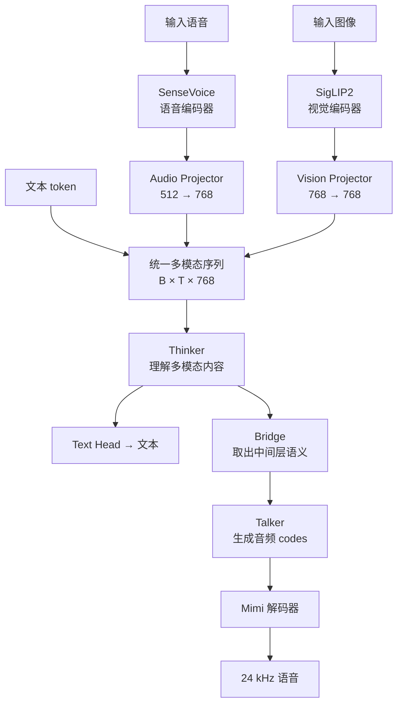
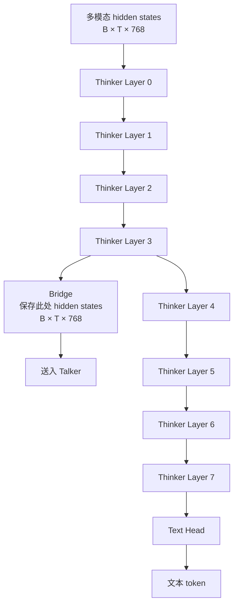
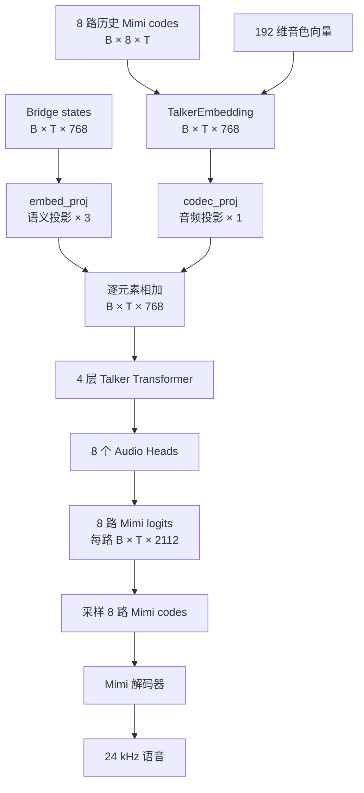

# MiniMind-O 项目入门笔记

> 目标：在正式逐行精读之前，先建立一张完整的“模型地图”，知道数据如何流动、张量如何变化、每个核心函数负责什么，以及作者提供的训练流程究竟训练了哪些部分。

## 1. 项目是什么

MiniMind-O 是一个小规模端到端多模态模型。它在 MiniMind 语言模型的基础上加入语音理解、图像理解和语音生成能力，使用一套权重完成：

- 输入：文本、语音、图像，或者它们的组合；
- 输出：文本，以及和文本同步生成的流式语音；
- 交互：支持音色条件、流式播放、VAD 打断和近似双工对话。

项目的核心目标不是追求大模型能力，而是用约 0.1B 的可训练主干，把 Omni 模型的完整链路做小、做全，方便个人理解和训练。

它不是简单的：

```text
语音 → ASR 文本 → LLM 文本 → TTS 语音
```

而是让语音、图像和文本在 Transformer 的隐藏状态空间中融合，再由独立的 Talker 根据语义隐藏状态直接预测可解码的音频 codes：

```text
文本 ───────────────────────────┐
语音 → SenseVoice → Projector ──┼→ Thinker → 文本 token
图像 → SigLIP2    → Projector ──┘     │
                                     │ Bridge hidden states
                                     ↓
音色条件 / 历史 Mimi codes ───────→ Talker → 8 路 Mimi codes → Mimi → 语音
```

### 1.1 主要外部组件

| 组件 | 用途 | 在默认训练中的状态 |
|---|---|---|
| MiniMind LLM | Thinker 的语言主干 | 从已有 `llm_768.pth` 初始化，继续训练 |
| SenseVoice-Small | 把输入语音编码为连续特征 | 冻结 |
| SigLIP2 | 把输入图像编码为视觉 token | 冻结 |
| Mimi | 把语音离散化为 8 路 codes，或把 codes 解码为 24 kHz 语音 | 冻结；训练数据中已预先存好 codes |
| CAM++ / CAMPPlus | 提取 192 维说话人向量 | 预先提取或在 WebUI 中使用 |

### 1.2 “从 0 训练”需要准确理解

这个项目强调“从 0 实现”，主要是指核心模型结构使用原生 PyTorch 编写，而不是依赖高层模型框架隐藏实现细节。

仓库默认的 mini 训练流程并不是“所有参数都随机初始化”：

1. Thinker 从 MiniMind LLM 权重开始；
2. 如果加载的 LLM 权重没有 Talker 参数，`init_omni_model` 会把 Thinker 最后 4 层复制给 Talker；
3. SenseVoice、SigLIP2、Mimi 和 CAM++ 都使用预训练模型；
4. 然后通过 T2A、A2A 等监督数据训练模态连接和语音生成能力。

因此，后续学习时应区分两个目标：

- **复现项目训练**：从已有语言模型和预训练编码器出发，训练一个 Omni 模型；
- **严格全随机训练**：还要从随机参数预训练语言模型、语音/视觉编码器、音频 codec 等，数据量和算力需求完全不是一个级别。

## 2. 项目目录

| 路径 | 作用 |
|---|---|
| `model/model_minimind.py` | MiniMind Transformer、Dense/MoE FFN、语言模型生成 |
| `model/model_omni.py` | 多模态 Projector、Thinker–Talker、流式音频 codes 生成 |
| `dataset/omni_dataset.py` | Parquet 数据读取、模态预处理、9 路训练序列和标签构造 |
| `trainer/trainer_utils.py` | 分布式初始化、模型加载、Talker 初始化、断点保存 |
| `trainer/train_sft_omni.py` | SFT 训练入口、损失函数、优化循环 |
| `trainer/train.sh` | 作者给出的 mini/full 分阶段训练命令 |
| `eval_omni.py` | 文本、语音、图像、混合输入的命令行推理 |
| `scripts/web_demo_omni.py` | Gradio Demo |
| `webui/` | 支持实时通话、VAD 打断和音色克隆的 WebUI |

## 3. 默认配置与符号

下文使用以下符号：

- \(B\)：batch size；
- \(T\)：统一序列长度；
- \(H=768\)：Thinker/Talker 隐藏维度；
- \(N_q=8\)：Query 注意力头数量；
- \(N_{kv}=4\)：Key/Value 注意力头数量；
- \(D_h=H/N_q=96\)：每个注意力头的维度；
- \(V_t=6400\)：文本词表大小；
- \(V_a=2112\)：音频词表大小，其中前 2048 个是 Mimi codes，其余位置用于特殊 token。

默认 Dense 模型的重要配置为：

| 配置 | 默认值 |
|---|---:|
| Thinker 层数 | 8 |
| Talker 层数 | 4 |
| hidden size | 768 |
| FFN intermediate size | 2432 |
| Query heads | 8 |
| KV heads | 4 |
| text vocab size | 6400 |
| audio vocab size | 2112 |
| image token 数 | 64 |
| bridge layer | 3（从 0 开始编号） |
| audio pad / stop / speaker token | 2049 / 2050 / 2051 |

## 4. MiniMind Transformer 原理

这一部分对应 `model/model_minimind.py`。

### 4.1 一个 Transformer Block

`MiniMindBlock.forward` 使用 Pre-Norm 和残差连接：

$$
X_1=X+\operatorname{Attention}(\operatorname{RMSNorm}(X))
$$

$$
Y=X_1+\operatorname{FFN}(\operatorname{RMSNorm}(X_1))
$$

输入和输出形状都不变：

```text
[B, T, 768] → MiniMindBlock → [B, T, 768]
```

核心函数：

- `MiniMindBlock.forward`：串联归一化、注意力、FFN 和两次残差连接；
- `MiniMindModel.forward`：依次执行多个 Block，管理 RoPE 和 KV Cache；
- `MiniMindForCausalLM.forward`：在隐藏状态后接语言模型输出头，得到文本 logits。

### 4.2 RMSNorm

`RMSNorm.forward` 不减均值，只根据均方根缩放向量。对一个 token 的隐藏向量 \(x\in\mathbb{R}^{768}\)：

$$
\operatorname{RMS}(x)=
\sqrt{\frac{1}{H}\sum_{i=1}^{H}x_i^2+\epsilon}
$$

$$
\operatorname{RMSNorm}(x)=g\odot\frac{x}{\operatorname{RMS}(x)}
$$

其中 \(g\) 是可学习缩放参数，形状为 `[768]`。代码先用 `float32` 计算归一化，再转回原 dtype，以提高混合精度训练的数值稳定性。

### 4.3 GQA 因果自注意力

`Attention.forward` 先做线性映射：

$$
Q=XW_Q,\qquad K=XW_K,\qquad V=XW_V
$$

默认输入：

```text
X: [B, T, 768]
```

映射并拆分注意力头后：

```text
Q: [B, T, 8, 96]
K: [B, T, 4, 96]
V: [B, T, 4, 96]
```

这是 GQA（Grouped Query Attention）：8 个 Q 头共享 4 个 KV 头。`repeat_kv` 将每个 KV 头复制 2 次，使其在计算时变为：

```text
K, V: [B, T, 8, 96]
```

转置为 `[B, 8, T, 96]` 后，每个头执行：

$$
\operatorname{Attention}(Q,K,V)
=\operatorname{softmax}
\left(
\frac{QK^\top}{\sqrt{D_h}}+M
\right)V
$$

其中：

- \(QK^\top\) 的形状是 `[B, 8, T, T]`；
- \(\sqrt{D_h}=\sqrt{96}\) 防止点积随维度增大而过大；
- \(M\) 是因果 mask，屏蔽当前位置之后的 token；
- 输出合并 8 个头后恢复为 `[B,T,768]`。

若运行环境支持，代码优先调用 PyTorch 的 `scaled_dot_product_attention`；否则显式计算分数、mask 和 softmax。

### 4.4 RoPE 位置编码

`precompute_freqs_cis` 预先计算每个位置的正弦和余弦，`apply_rotary_pos_emb` 再对 Q、K 的成对维度进行旋转。

从第一性原理看，自注意力本身只比较 token 内容，并不知道先后顺序。RoPE 把位置信息写进 Q、K，使它们的点积同时包含内容关系和相对距离信息。

形状保持不变：

```text
Q, K: [B, T, heads, 96]
  ↓ RoPE
Q', K': [B, T, heads, 96]
```

生成时只为新 token 取对应位置的 RoPE，并通过 KV Cache 复用历史 K、V。

### 4.5 SwiGLU FFN

`FeedForward.forward` 使用类似 SwiGLU 的门控前馈网络：

$$
\operatorname{FFN}(X)
=W_{\text{down}}
\left(
\operatorname{SiLU}(XW_{\text{gate}})
\odot(XW_{\text{up}})
\right)
$$

默认维度变化：

```text
X                       [B, T, 768]
gate_proj / up_proj     [B, T, 2432]
逐元素相乘               [B, T, 2432]
down_proj               [B, T, 768]
```

`MOEFeedForward` 是可选替代方案：每个 token 经过 Router 选择专家，默认 4 个专家、每个 token 激活 1 个专家，并增加负载均衡辅助损失。mini 训练命令默认 `use_moe=0`，因此先理解 Dense FFN 即可。

## 5. 多模态信息如何进入 Thinker

这一部分主要对应 `MiniMindOmni.forward`。

### 5.1 文本输入

训练时的完整 `input_ids` 是 `[B,9,T]`，第 9 路是文本：

```python
text_ids = input_ids[:, 8, :]   # [B, T]
```

文本 embedding 后：

```text
[B, T] → Embedding(6400, 768) → [B, T, 768]
```

如果普通推理只传入 `[B,T]` 的文本，模型会自动创建 8 路全部为 `audio_pad_token` 的音频输入。

### 5.2 语音输入

语音输入链路为：

```text
波形
  ↓ 统一到 16 kHz
fbank: [B, T_a, 560]
  ↓ 冻结的 SenseVoice encoder
audio features: [B, T'_a, 512]
  ↓ MMAudioProjector
projected features: [B, T'_a, 768]
```

`MMAudioProjector` 的计算为：

```text
LayerNorm(512) → Linear(512,768) → GELU → Linear(768,768)
```

关键函数：

- `SenseVoiceAudioProcessor.__call__`：波形转 SenseVoice 所需 fbank；
- `encode_audio_inputs`：冻结 SenseVoice 前向，只训练 `audio_proj`；
- `inject_audio_features`：找到连续的 `<|audio_pad|>` 文本占位符，将其 embedding 替换为真实语音特征。

这里不是把语音转写为文字，而是把语音连续特征直接放进 Thinker 的 `[B,T,768]` 序列。

### 5.3 图像输入

默认图像会被处理为 `256×256`。SigLIP2 P32 将图像编码为 64 个 patch token：

```text
image: [B, 3, 256, 256]
  ↓ 冻结的 SigLIP2
[B, 64, 768]
  ↓ MMVisionProjector
[B, 64, 768]
```

`MMVisionProjector` 是：

```text
LayerNorm(768) → Linear(768,768) → GELU → Linear(768,768)
```

关键函数：

- `get_image_embeddings` / `encode_image_inputs`：运行冻结的视觉编码器和可训练 Projector；
- `count_vision_proj`：找到连续的 64 个 `<|image_pad|>`，用 64 个视觉特征替换它们。

因此三种模态最终都变成统一形状的 768 维 token：

```text
文本 token embedding ─┐
语音 projected token ─┼→ [B, T, 768] → Thinker
图像 projected token ─┘
```

## 6. Thinker–Bridge–Talker

先用一张简化图理解整体关系。Thinker、Bridge 和 Talker 的内部结构会在后面分别展开。



最简化的数据流是：

```text
                       ┌→ Thinker 后半段 → Text Head → 文本
多模态输入 → Thinker 前半段 → Bridge
                       └→ Talker → 8 路 Mimi codes → Mimi → 语音
```

### 6.1 Thinker

Thinker 就是 8 层 MiniMind Transformer。它接收已经融合多模态特征的序列，最后得到：

```text
h_thinker: [B, T, 768]
text_logits: [B, T, 6400]
```

每个位置的 6400 维 logits 表示下一个文本 token 的未归一化分数。

### 6.2 Bridge

下面只看 Thinker 内部，Bridge 的位置就会更清楚：



#### Bridge 在模型中的位置

Talker 不使用 Thinker 的最后一层，而是读取中间层。默认位置由下面的配置确定：

```python
bridge_layer = num_hidden_layers // 2 - 1
```

默认 8 层时 `bridge_layer=3`，也就是执行完第 4 个 Block 后保存：

```text
多模态输入
   ↓
Thinker Layer 0
   ↓
Thinker Layer 1
   ↓
Thinker Layer 2
   ↓
Thinker Layer 3 ─────→ Bridge: [B,T,768] ─────→ Talker
   ↓
Thinker Layer 4
   ↓
Thinker Layer 5
   ↓
Thinker Layer 6
   ↓
Thinker Layer 7
   ↓
Text Head → 文本 token
```

对应源码见 [`model_omni.py:288`](../model/model_omni.py#L288)：

```python
bridge_states = hidden_states

for i, layer in enumerate(self.thinker.layers):
    hidden_states, present = layer(hidden_states, ...)

    if i == self.config.bridge_layer:
        bridge_states = hidden_states
```

这里有两个容易误解的地方：

1. **Bridge 不是一个新的神经网络层，也没有自己的参数。**
   它只是把 Thinker 中间位置的 `hidden_states` 保存为 `bridge_states`。
2. **Thinker 在 Bridge 处不会停止。**
   隐藏状态一份送给 Talker，原来的 Thinker 主路仍继续执行第 4～7 层并生成文本。

因此，Bridge 更准确的理解是：

```text
Bridge = 从 Thinker 中间层引出的一条语义信息支路
```

#### 为什么使用中间层

Thinker 不同深度的隐藏状态具有不同侧重点：

```text
较浅层                    中间层                         最后层
词和局部模式       上下文、多模态和通用语义       为下一个文本 token 优化
```

具体来说：

- 过浅层更接近原始 embedding，语义融合不足；
- 最后一层被文本 next-token prediction 目标强烈塑形；
- 中间层已经融合上下文和多模态信息，又保留较通用的语义表示，适合给语音生成提供条件。

可以把 Bridge 理解为 Thinker 给 Talker 的“语义草稿”：它主要描述回答内容，而不是具体的文本词表概率。

### 6.3 Talker 的音频输入

下面单独展开 Talker。它不是直接把 Bridge 变成声音，而是先融合语义、历史声音和音色：



#### Talker 在模型中的位置和作用

Talker 位于 Bridge 分支的下游，是 `MiniMindOmni` 中独立的语音生成网络。其定义见 [`model_omni.py:88`](../model/model_omni.py#L88)，主要包含：

- 4 个 `MiniMindBlock`；
- 融合 8 路音频历史的 `TalkerEmbedding`；
- 语义投影 `embed_proj`；
- 音频投影 `codec_proj`；
- 8 个音频输出头；
- 说话人向量投影 `spk_proj`。

Thinker 负责理解输入和组织回答内容，Talker 不再重新理解原始文本、图像或语音，而是根据 Thinker 提供的语义状态生成声音：

```text
Thinker：决定“说什么”
Talker：决定“怎样把这些内容说出来”
Mimi：把离散音频 codes 还原成真实声波
```

#### Talker 为什么还需要历史音频 codes

只知道“说什么”还不足以生成连续语音。Talker 还需要知道前面已经生成了什么声音，才能保证发音、节奏和音色连续。

因此，Talker 同时接收：

```text
Bridge states       [B,T,768]   → 语义条件：接下来应该说什么
历史 Mimi codes     [B,8,T]     → 声学条件：前面已经怎样发声
说话人向量          [B,192]     → 音色条件：使用谁的声音
```

8 路历史 Mimi codes 首先表示为：

```text
audio_ids: [B, 8, T]
```

`TalkerEmbedding.forward` 没有简单拼接 8 路 embedding，而是为各 codebook 使用“共享基础 embedding + 独立 adapter”，然后取平均：

$$
E_{\text{audio}}
=\frac{1}{8}\sum_{i=1}^{8}
\left(E_{\text{base}}(c_i)+A_i(c_i)\right)
$$

输出：

```text
talker_emb: [B, T, 768]
```

如果某处是 `audio_spk_token`，还会用 `spk_proj` 把 192 维 CAM++ 说话人向量映射到 768 维并替换该位置，用于约束音色。

### 6.4 语义与音频条件融合

Talker 的初始隐藏状态为：

$$
H_0=
\alpha P_{\text{text}}(H_{\text{bridge}})
+\beta P_{\text{audio}}(E_{\text{audio}})
$$

对应代码中的：

- \(P_{\text{text}}\)：`talker.embed_proj`；
- \(P_{\text{audio}}\)：`talker.codec_proj`；
- \(\alpha\)：可学习的 `text_scale`，初始值 3；
- \(\beta\)：可学习的 `audio_scale`，初始值 1。

两条分支都是 `[B,T,768]`，所以可以逐元素相加：

```text
bridge_states [B,T,768] → embed_proj ─×3─┐
                                         ├→ Talker input [B,T,768]
audio embedding [B,T,768] → codec_proj ─×1┘
```

初始时语义条件权重更大，但两个比例会随训练自动调整。

对应源码见 [`model_omni.py:301`](../model/model_omni.py#L301)：

```python
hidden_states = (
    self.talker.embed_proj(bridge_states) * self.talker.text_scale
    + self.talker.codec_proj(talker_emb) * self.talker.audio_scale
)
```

这一步可以从两个问题理解：

```text
Bridge 分支回答：下一段语音应该表达什么内容？
Audio 分支回答：基于已经生成的声音，下一帧应该怎样延续？
```

### 6.5 Talker 输出 8 路 Mimi logits

融合后的状态经过 4 个 Talker Block：

```text
[B, T, 768] → 4×MiniMindBlock → [B, T, 768]
```

`TalkerHead.forward` 使用一个共享基础输出头，再为每个 codebook 增加独立 adapter：

$$
Z_i=W_{\text{base}}H+A_i(H),\qquad i=0,\ldots,7
$$

最终得到一个长度为 8 的 Python 列表：

```text
audio_logits[0]: [B, T, 2112]
audio_logits[1]: [B, T, 2112]
...
audio_logits[7]: [B, T, 2112]
```

共享主体控制参数量，独立 adapter 则允许 8 个 Mimi codebook 学习不同分布。

Talker 输出的仍然不是声波。每路 `2112` 维 logits 表示下一个音频 token 在音频词表上的未归一化分数。采样得到 8 路 codes 后，冻结的 Mimi 才将它们解码为连续语音：

```text
Talker hidden states
    ↓
8 路 [B,T,2112] logits
    ↓ 采样
8 路离散 Mimi codes
    ↓ Mimi decoder
24 kHz 连续语音
```

#### 三者的一句话总结

```text
Thinker：理解输入，决定“说什么”
Bridge：从 Thinker 中间层取出通用语义，传给语音分支
Talker：结合语义、历史声音和音色，决定“怎么说”
```

### 6.6 流式生成

`stream_generate` 在同一个自回归循环中：

1. 根据 `text_logits` 采样下一个文本 token；
2. 根据 8 个 `audio_logits` 采样各 codebook 的下一个 code；
3. 使用 delay schedule 让第 \(i\) 路 codebook 延迟 \(i\) 步开始；
4. 当 8 路 codes 对齐成完整 Mimi frame 后向外输出；
5. `eval_omni.py` 将这些 frames 交给 Mimi 解码为音频波形。

延迟调度可以画成：

```text
生成步        0  1  2  3  4  5  6  7  8 ...
codebook 0       c  c  c  c  c  c  c  c ...
codebook 1          c  c  c  c  c  c  c ...
codebook 2             c  c  c  c  c  c ...
...
codebook 7                            c  c ...
```

这使模型在每个时间步并行推进多个 codebook，而不是把 8 路 codes 串成一条 8 倍长的序列。

## 7. 训练样本如何构造

这一部分对应 `dataset/omni_dataset.py`。

### 7.1 Parquet 样本字段

`OmniDataset.__getitem__` 会按存在情况读取：

| 字段 | 含义 |
|---|---|
| `conversations` | JSON 格式的多轮文本对话 |
| `question_audios` | 用户输入音频 |
| `answer_audios` | 助手回答对应的交错 Mimi codes |
| `image_bytes` | 输入图像二进制 |
| `ref_audios` | 音色参考音频的 Mimi codes |
| `spk_emb` | 192 维说话人向量 |

数据集只对随机选中的最后一个 assistant 回答计算监督损失，前面的轮次作为上下文。

### 7.2 9 路统一输入

构造完成后，单个样本为：

```text
input_ids:    [9, T-1] = 8 路 audio codes + 1 路 text ids
text_labels:  [T-1]
audio_labels: [8, T-1]
```

Collate 后增加 batch 维：

```text
input_ids:    [B, 9, T-1]
text_labels:  [B, T-1]
audio_labels: [B, 8, T-1]
```

`X_text=input_ids[:-1]`、`text_labels=labels[1:]` 实现标准 next-token prediction：

```text
输入：  x0  x1  x2  x3
目标：  x1  x2  x3  x4
```

音频序列也做同样的整体右移，同时第 `i` 个 codebook 的目标从 `assistant_start+i+1` 开始，和推理时的 delay schedule 保持一致。

### 7.3 标签 mask

无需训练的位置设为 `-100`：

- 用户问题、system prompt 和历史 assistant 不计算文本损失；
- 只有选中的最后一个 assistant 回答计算文本损失；
- 只有对应回答的目标 Mimi codes 计算音频损失；
- 参考音色 codes 和说话人条件只作为输入，不作为重构目标。

`generate_text_labels` 负责定位 assistant 区域并创建文本标签；`__getitem__` 再屏蔽前面 assistant，只保留最后一个回答。

### 7.4 Scheduled Sampling

训练总是喂入正确历史 token，推理却会喂入模型自己可能出错的预测，这叫 exposure bias。

`apply_scheduled_sampling` 以默认 5% 概率把受监督位置的历史文本或音频 token 换成随机 token，让模型学习从错误历史中恢复。代码会保护图像占位 token 的连续性，避免破坏多模态特征注入位置。

## 8. 损失函数

这一部分对应 `trainer/train_sft_omni.py` 的 `train_epoch`。

### 8.1 文本损失

对所有 `label != -100` 的位置计算交叉熵：

$$
L_{\text{text}}
=-\frac{1}{N_t}
\sum_{j\in\mathcal{V}_t}
\log p(y_j\mid x_{\le j})
$$

其中 \(\mathcal{V}_t\) 是有效文本标签位置集合。

### 8.2 音频损失

8 个 codebook 分别计算交叉熵，再取平均：

$$
L_{\text{audio}}
=\frac{1}{8}\sum_{i=1}^{8}L_{\text{audio},i}
$$

代码对 `audio_stop_token=2050` 使用：

```python
1 + stop_mask * 9
```

所以停止 token 的损失权重是普通有效 token 的 10 倍。原因是每路序列只有一个停止标记，如果与大量普通 codes 等权，它很容易被忽略；提高权重能帮助 8 路生成在正确位置结束。

### 8.3 总损失

一次前向的目标为：

$$
L=
L_{\text{text}}
+L_{\text{audio}}
+L_{\text{MoE}}
$$

Dense 模型的 \(L_{\text{MoE}}=0\)。启用 MoE 时，它是 Router 的专家负载均衡损失。

梯度累积时，代码再除以 `accumulation_steps`，保证多个 micro-batch 累积后的梯度尺度合理。

## 9. mini 训练流程

`trainer/train.sh` 给出的单卡 mini 流程分三步，默认目标是低成本跑通完整链路，不等于复现发布权重的最终能力。

### 阶段 1：T2A 基础训练

```text
初始化：llm_768.pth
数据：sft_t2a_mini.parquet
模式：all
学习率：5e-4
```

T2A（Text to Audio）让 Talker 先学会：在 Thinker 文本语义条件下生成回答对应的 Mimi codes。此时没有用户语音输入，重点是建立文本语义到语音 codes 的映射。

### 阶段 2：A2A 音频 Projector 对齐

```text
初始化：阶段 1 的 sft_zero
数据：sft_a2a_mini.parquet
模式：audio_proj
学习率：5e-4
```

代码冻结所有参数，只解冻 `model.audio_proj`。目标是在不扰动已有 Thinker–Talker 能力的情况下，把 SenseVoice 的 512 维语音特征映射到 Thinker 已熟悉的 768 维语义空间。

### 阶段 3：A2A 全量微调

```text
初始化：阶段 2 的 sft_zero
数据：sft_a2a_mini.parquet
模式：all
学习率：2e-5
```

低学习率联合调整 Thinker、Talker 和 Projector，让模型适应：

```text
用户语音 → SenseVoice → audio_proj → Thinker → Talker → 回答语音
```

full 流程还会加入 I2T 图像数据、`vision_proj` 对齐，以及多轮低学习率交替微调；但理解 mini 三阶段后，其原理是相同的。

## 10. 核心函数地图

### 10.1 `model/model_minimind.py`

| 函数/类 | 输入 → 输出 | 核心作用 |
|---|---|---|
| `RMSNorm.forward` | `[...,768] → [...,768]` | 对隐藏向量做均方根归一化 |
| `precompute_freqs_cis` | 配置 → sin/cos 表 | 预计算 RoPE |
| `apply_rotary_pos_emb` | Q、K → 旋转后的 Q、K | 注入位置信息 |
| `repeat_kv` | 4 个 KV 头 → 8 个 KV 头 | 实现 GQA 的 KV 共享 |
| `Attention.forward` | `[B,T,768] → [B,T,768]` | 因果自注意力和 KV Cache |
| `FeedForward.forward` | `[B,T,768] → [B,T,768]` | SwiGLU 非线性变换 |
| `MOEFeedForward.forward` | token → 专家加权输出 | 可选 MoE 路由 |
| `MiniMindBlock.forward` | hidden states → hidden states | Attention + FFN + 残差 |
| `MiniMindModel.forward` | token ids/embeddings → hidden states | 执行完整 Transformer 主干 |
| `MiniMindForCausalLM.forward` | hidden states → text logits | 文本 next-token prediction |

### 10.2 `model/model_omni.py`

| 函数/类 | 核心作用 |
|---|---|
| `OmniConfig` | 定义 Talker、模态维度、特殊 token 和 Bridge 层 |
| `MMAudioProjector` | SenseVoice 512 维 → Thinker 768 维 |
| `MMVisionProjector` | SigLIP2 768 维 → Thinker 768 维 |
| `TalkerEmbedding` | 融合 8 路历史 Mimi codes |
| `TalkerHead` | 输出 8 组 audio logits |
| `encode_audio_inputs` | 冻结 SenseVoice 编码并执行 audio projector |
| `inject_audio_features` | 用语音特征替换音频占位 token |
| `encode_image_inputs` | 冻结 SigLIP2 编码并执行 vision projector |
| `count_vision_proj` | 用图像特征替换图像占位 token |
| `MiniMindOmni.forward` | 完成 Thinker、Bridge、Talker 全部前向 |
| `stream_generate` | 同步自回归生成文本和 8 路音频 codes |
| `SileroVAD` / `RealtimeSession` | 实时打断与会话工程逻辑，不属于模型主体 |

### 10.3 数据与训练

| 函数 | 核心作用 |
|---|---|
| `OmniDataset.create_chat_prompt` | 将对话、音频/图像占位符组织成 Chat Template |
| `OmniDataset.generate_text_labels` | 只为 assistant 内容建立文本监督 |
| `OmniDataset.apply_scheduled_sampling` | 随机扰动少量历史 token |
| `OmniDataset.__getitem__` | 构造 9 路输入、文本标签和 8 路音频标签 |
| `omni_collate_fn` | 对可变长音频和多模态数据组成 batch |
| `init_omni_model` | 加载权重、初始化 Talker、应用冻结策略 |
| `train_epoch` | 前向、文本/音频损失、反向和保存权重 |
| `eval_sample` | 调用流式生成并用 Mimi 解码音频 |

## 11. 推荐精读顺序

### 第 1 阶段：先搞懂语言模型骨架

阅读 `model/model_minimind.py`：

1. `MiniMindConfig`
2. `RMSNorm`
3. `Attention`
4. `FeedForward`
5. `MiniMindBlock`
6. `MiniMindModel`
7. `MiniMindForCausalLM`

目标：能够手算一个 `[B,T,768]` 张量经过一层 Transformer 时的每次维度变化。

### 第 2 阶段：理解 Omni 架构

阅读 `model/model_omni.py`：

1. `OmniConfig`
2. Audio/Vision Projector
3. `TalkerEmbedding` 和 `TalkerHead`
4. `MiniMindOmni.forward`
5. `stream_generate`

目标：能画出文本、语音、图像从输入到文本/语音输出的完整计算图。

### 第 3 阶段：理解监督信号

阅读 `dataset/omni_dataset.py`，重点跟踪一个样本：

```text
Parquet 原始字段
→ chat prompt
→ 文本 token
→ 8 路 Mimi codes
→ [9,T] 输入
→ text_labels / audio_labels
```

目标：理解“模型输入什么、正确答案是什么、哪些位置计算损失”。

### 第 4 阶段：理解训练

依次阅读：

1. `trainer/trainer_utils.py`
2. `trainer/train_sft_omni.py`
3. `trainer/train.sh`

目标：能够解释三个 mini 训练阶段分别加载什么权重、冻结什么参数、优化什么能力。

### 第 5 阶段：理解推理

阅读 `eval_omni.py`，再回看 `stream_generate`。

目标：理解 KV Cache、文本采样、音频 delay schedule、Mimi 解码如何组成流式回答。

## 12. 当前阶段应记住的五件事

1. **所有输入最终都要变成 768 维 token，才能进入同一个 Thinker。**
2. **Thinker 负责“理解和说什么”，Talker 负责“如何把语义渲染成音频 codes”。**
3. **Bridge 使用 Thinker 中间层，把文本目标和语音目标解耦。**
4. **训练输入是 8 路音频加 1 路文本，两个任务分别计算交叉熵。**
5. **默认训练是基于预训练组件进行 Omni 对齐和 SFT，不是所有组件从随机参数开始。**
